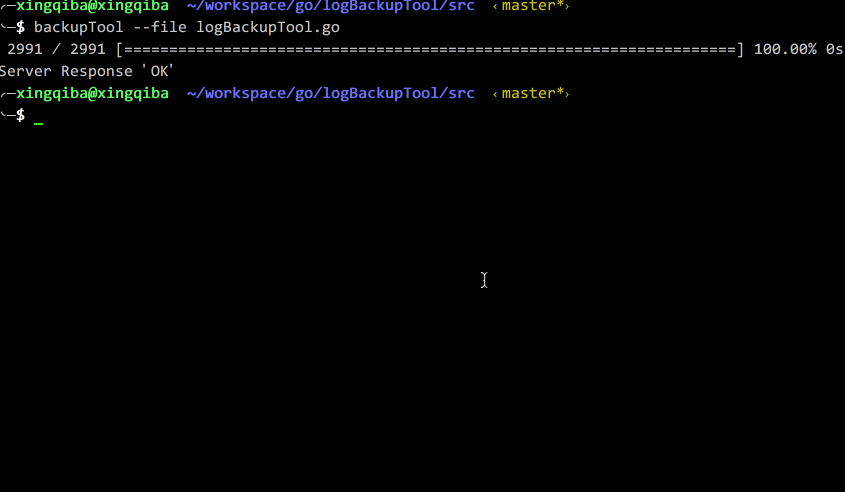

# logBackupTool

## usage
```
Usage: ./logBackupTool [options]
Options:
  -config string
    	config (default "/etc/logBackup.conf")
  -file string
    	send file to server
  -server
    	run as server mode (default false)
  -client
    	set run as client mode (default true)
  -path string
    	set send file to server backup path
  -verbose
    	show run details (default true)
```

### logBackup.conf
```
[server]
bind-address=127.0.0.1:2010
datadir=/Users/xingqiba/workspace/go/logBackupTool/logs

[client]
server-address=127.0.0.1:2010
```

## server
```
./logBackupTool --config ../conf/logBackup.conf --server
```

## client
```
./logBackupTool --file test.log --path server_save_path
```

## snapshoot


### FAQ
更多疑问请+qq群 233415606 or [website http://www.hnphper.com](http://www.hnphper.com)
